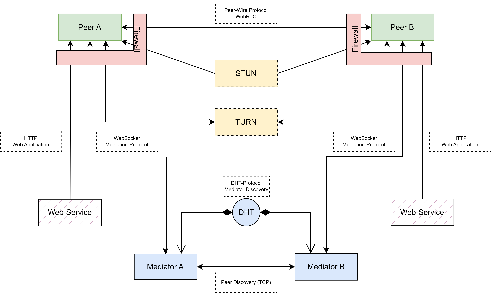
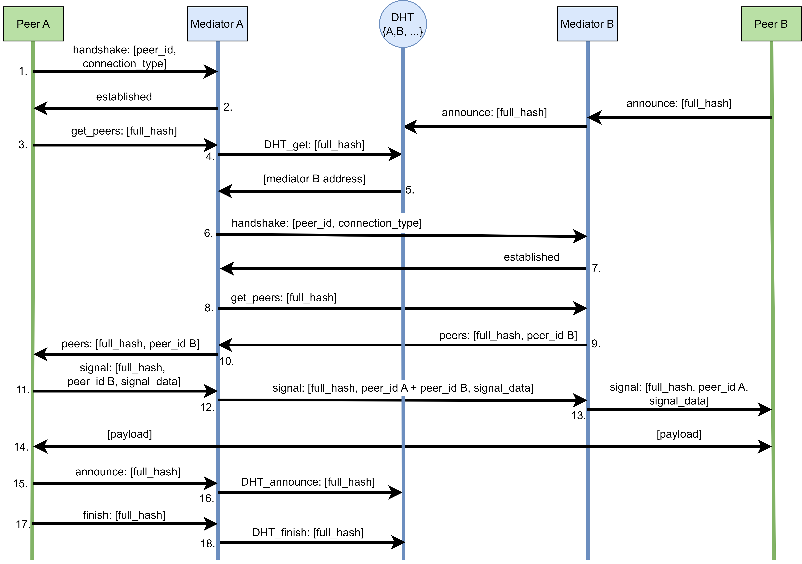
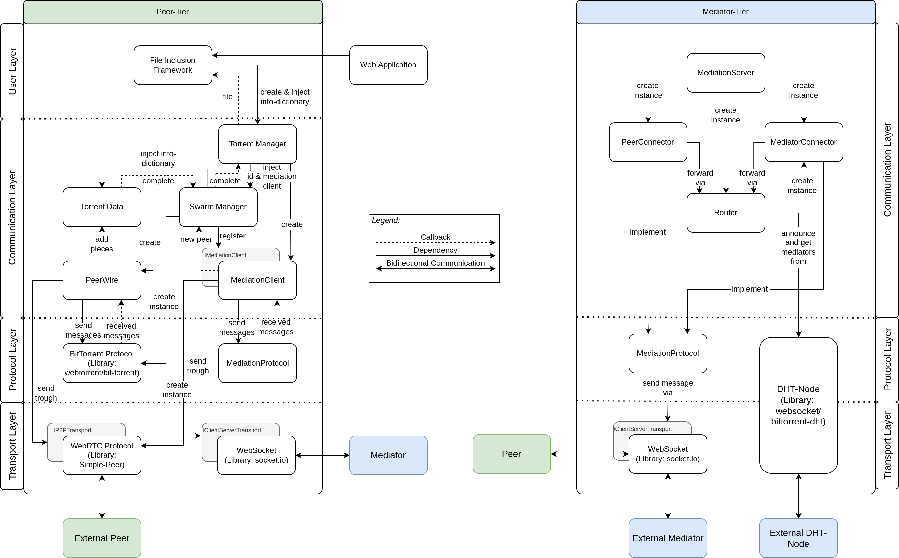

# P2P CDN
A prototype of a completely decentralized web-based peer-to-peer content delivery network (P2P CDN). The main difference from existing solutions is that a dedicated decentralized peer discovery mechanism has been developed.

## Introduction
Production ready web-applications have historically been centralized in their way of distributing data. Peer-to-peer protocols such as BitTorrent have only recently been introduced to the web thanks to the increasing support of WebRTC. A paper was written to analyze technologies that already take advantage of this while proposing improvements to increase decentralization.

After researching currently available technologies and proposing a new concept of a system, we prove our proposed concept by developing a prototype. The focus of this implementation is to be as decentralized as possible, while still working in a web-application without the need to install any plugins or external software as a user.

Our concept, backed by the prototype in this repository, proves that it is possible to implement a system for delivering files in a peer-to-peer fashion without any single centralized services. Arguably, the developed system is not suitable for small, latency sensitive data, because of the latency introduced by the complex nature of peer-to-peer connection establishment. With current technologies, a sub-second download of any file is therefore impossible.

Latency can still be improved by prioritizing peers for latency, to reach smaller round-trip times and therefore faster connection-establishment. Due to this project being limited in time, this mechanism remains to be solved by future work.

## Documentation
This work was done as part of a Student Research Project at [OST - Eastern Switzerland University of Applied Sciences](https://www.ost.ch/en/). The link to the report will be inserted here as soon as it has been published.

## Concept
### Overview
The following is a conceptual overview for a fully-decentralized in-browser P2P-CDN.  


### Mediation Protocol Definition
| Message | Parameters | Semantics |
| - | - | - |
| handshake | peer id, connection type | Sent from peer to mediator to announce peer-id and the connection type (mediation or replication) |
| established | - | Sent from mediator to peer to announce that the connection is established |
| get_peers | full hash | Sent to request peer-IDs of peers that seed the data-unit fitting the full-hash |
| peers | full hash, peer list | Sent as a response to get peers |
| signal | full hash, peer id, signal data | Sent to transport signaling information between two peers |
| announce | full hash | Sent from peer to mediator, to announce the start of seeding |
| finish | full hash | Sent from peer to mediator, to announce the end of seeding |

### Mediation Process
The following sequence diagram describes how mediation proceeds in a conceptual manner.


### Components
The components shown below do not contain all the classes and modules of the source code exactly but represent the most important units of functionality and their interactions.


## Installation
### Dependency Installation
```
cd common
npm install
cd ..

cd mediator
npm install
cd ..

cd peer
npm install
cd ..
```

### Execute on Localhost
1. Install all dependencies
2. Execute compile script
    1. Windows: `.\compile.ps1`
    2. Linux: `.\compile.sh`
3. Run mediator
    1. Option 1: Create a run config in your IDE
    2. Option 2: `node .\mediator\out\mediator\src\index.js <mediator-port> <dht-port> <optional-bootstrap-address>`
4. Open `seeder_preview.html` in your browser
5. Open `leecher_preview.html` in your browser

### Execute Remotely
1. Run mediator on an external web server
2. Update serverUrl and serverPort in your `.\preview\index.html`
4. Open `.\preview\index.html` in your browser